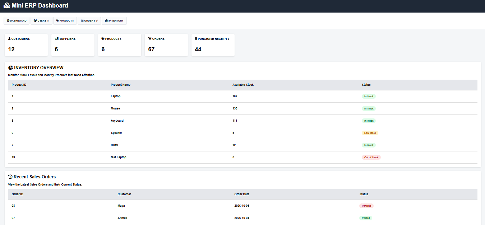

1. Business Central-Inspired Mini ERP

A full-stack mini ERP system inspired by Microsoft Dynamics 365 Business Central processes.

This project demonstrates how common ERP business processes can be connected with software development, databases, APIs, and a web-based dashboard.

The system focuses on sales, purchasing, inventory management, order fulfillment, shortage handling, and posting workflows.

Disclaimer: This is a standalone educational ERP project inspired by Microsoft Dynamics 365 Business Central concepts. It is not an implementation of Microsoft Dynamics 365 Business Central.

2. Features
- Customer management
- Vendor management
- Product and inventory management
- Sales order management
- Purchase order management
- Inventory transaction tracking
- Partial order fulfillment
- Shortage detection and handling
- Automatic purchase order creation for shortages
- Product receiving and stock updates
- Sales order posting workflow
- Sales order pricing and totals
- REST API integration
- JSON-based communication
- SQL Server database
- Web-based ERP dashboard

3. Technology Stack
- Frontend: HTML, CSS, JavaScript
- Backend: C# / ASP.NET Core
- Database: Microsoft SQL Server
- ORM: Entity Framework Core
- API: REST API
- Data Format: JSON
- Development Environment: Visual Studio Code, SQL Server Management Studio, Postman  

4. System Architecture

The project follows a simple full-stack architecture:

Web Dashboard

HTML / CSS / JavaScript

        ↓
ASP.NET Core REST API

        ↓
Entity Framework Core

        ↓
SQL Server Database

The frontend communicates with the backend through REST API endpoints using JSON.

The API handles business logic such as sales orders, inventory updates, shortage handling, purchase orders, and order fulfillment.

5. Business Process Workflow

Sales Order Process

- A customer places a sales order.
- The system checks the available inventory.
- If sufficient stock is available, the order can be fulfilled.
- If stock is insufficient, the system calculates the shortage.
- The available quantity can be partially fulfilled.
- A purchase order is created for the missing quantity.
- The purchased items are received and inventory is updated.
- The remaining sales order quantity can then be fulfilled.
- Once all ordered quantities are fulfilled, the sales order is posted.

Inventory Tracking
Inventory movements are recorded separately from the product master data.

Examples include:

- Sales → negative inventory quantity
- Purchase receipt → positive inventory quantity

This provides a transaction history that can be used to understand how inventory changes over time.

6. Business Central Concept Mapping

The project is inspired by common Microsoft Dynamics 365 Business Central concepts and workflows.

- Products -> Business Central Items

- Customers -> Business Central Customers
  
- Suppliers -> Vendors

- Sales Orders -> Sales Orders

- Purchase Orders -> Purchase Orders

- Inventory transactions -> Item Ledger Entries

- Sales order posting -> Sales Posting Process

- Purchase receiving -> Purchase receipt and posting process

- Order fulfillment -> Sales order fulfillment
  
- Order and line data -> Document headers and document lines
  

The project also helped demonstrate the distinction between:

- Documents — such as Sales Orders and Purchase Orders
- Posting — recording the business transaction and updating related records
- Inventory transactions — tracking changes in item quantities
- Master data — Items, Customers, and Vendors
  

7. Shortage Handling Example

The system supports partial fulfillment when there is not enough inventory to satisfy a sales order.

Example:

Customer orders:       10 laptops
Available inventory:    6 laptops
Shortage:               4 laptops

Partial fulfillment:    6 laptops
Purchase Order:         4 laptops
Goods received:         4 laptops
Remaining fulfillment:  4 laptops

Final result:
Sales Order → Posted
Inventory → Updated

This workflow demonstrates how the system can handle inventory shortages while keeping the sales order open until the remaining quantity is fulfilled.

8. Project Structure

The project is organized into separate frontend and backend components.

Mini ERP
│
├── Frontend
│   ├── HTML
│   ├── CSS
│   └── JavaScript
│
├── Backend
│   ├── ASP.NET Core API
│   ├── Models
│   └── API Endpoints
│
└── Database
    └── SQL Server
    
The frontend provides the ERP dashboard and communicates with the backend through REST API endpoints.

The backend handles business logic and database operations through Entity Framework Core.

9. Screenshots 

ERP Dashboard
The dashboard provides access to customer management, vendor management, products, inventory, sales orders, and purchase orders.

10. Project Purpose

This project was developed as a practical learning and portfolio project to understand ERP business processes and how they connect with software technologies.

The project focuses on concepts relevant to Microsoft Dynamics 365 Business Central, including:

- Sales and purchasing processes
- Inventory management
- Order fulfillment
- Posting workflows
- Business requirements and functional analysis
- REST API and system integration
- Database design and SQL
- Frontend and backend communication
  
Note: This project is a standalone ERP application inspired by Business Central concepts. It does not use or modify the Microsoft Dynamics 365 Business Central platform.
